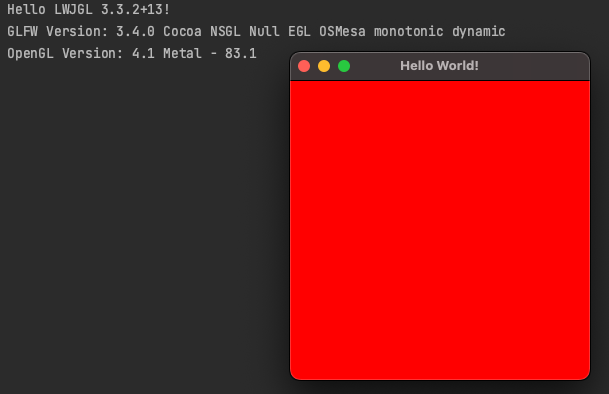

# LWJGL Hello World Application

This is a simple [Hello World application](https://www.lwjgl.org/guide) that uses [LWJGL 3](https://www.lwjgl.org). It is meant to be used as a starting point for anyone looking to create a new LWJGL 3 application.

Read the [3D Game Development with LWJGL 3](https://lwjglgamedev.gitbooks.io/3d-game-development-with-lwjgl/content/) tutorial series to learn more about creating 3D games with LWJGL 3.